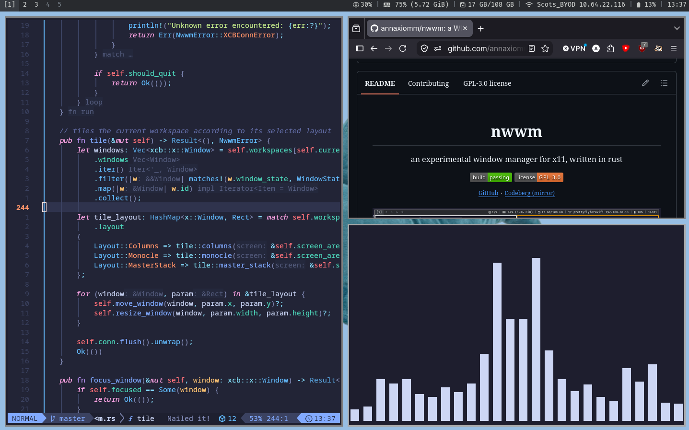

# nwwm
an experimental window manager for X11

## Features
- [x] runs
- [x] attaches to X server
- [x] can open at least 1 window
- [x] columns tiling 
- [x] click to focus
- [x] (some) EWMH compliance 
- [ ] that's it for now - more updates coming soon

## Installation / testing
**you will need:**
- rust & cargo
- xorg-server and xorg-xinit
- Xephyr

I severely recommend that you DO NOT install nwwm as it is. it's 100% unusable and you will be stuck with a black screen (or whatever your wallpaper is).

to test it, make sure you aren't using display 2 for anything then run `./test.sh &`. after that, open your app of choice with `DISPLAY=:2 <app-name>`
